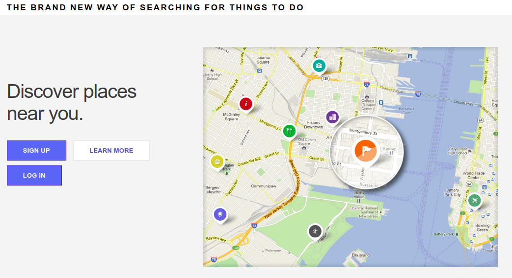

# Mapio

Web App that let's you find new cool places around you and discover new points of interest wherever you are.

After a user enters coordinates(latitude & longitude) or address of a place, by using *Wikipedia's geodata API* application will show on the map places nearby within specified walking distance.

## Getting Started

These instructions will get you a copy of the project up and running on your local machine for development and testing purposes.

Clone the GitHub repository:
```
git clone https://github.com/wingedRuslan/locationService.git
```

Install the requirements from *requirements.txt*:
```
pip install -r requirements.txt
```

Run the application:
```
python app.py
```

## Home page

